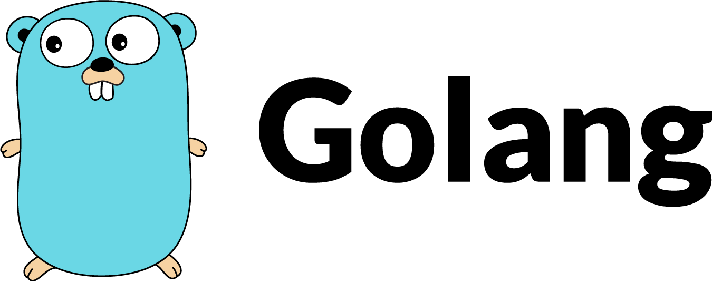
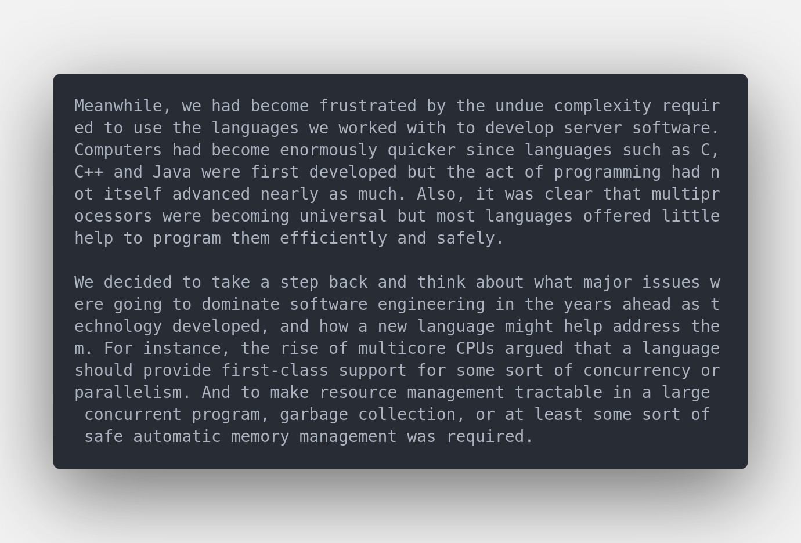
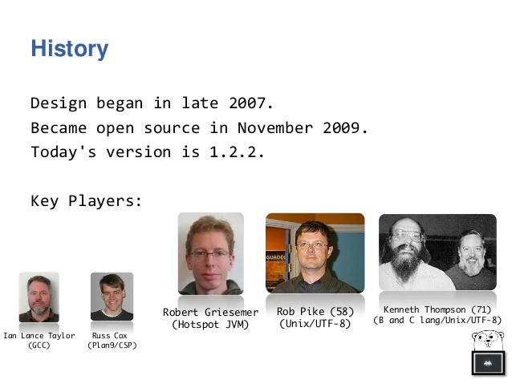
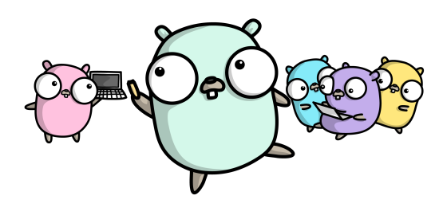
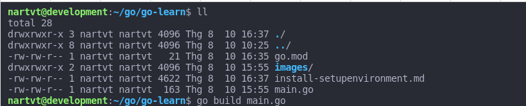
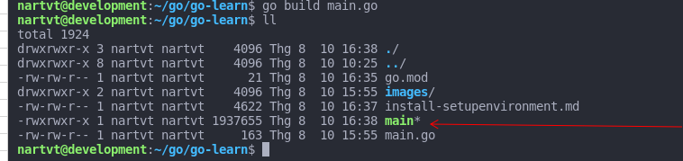
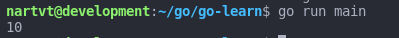
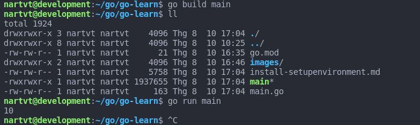

# Go(Golang) là gì , nguồn gốc và sự ra đời của Go



## Go(Golang) là gì 
- The Go programming language is an open source project to make programmers more productive.

    ==> là một ngôn ngữ lập trình mã nguồn mở giúp các lập trình viên làm việc hiệu quả hơn, nhanh hơn,  giảm đi độ phức tạp trong lập trình phần mềm trong khi vẫn giữ được hiệu năng ấn tượng.


## Nguồn gốc cho sự ra đời của Go
### Lý do: 
* Tận dụng được sức mạnh phần cứng nhiều lõi của phần cứng thế hệ mới


<br>

* Một số lập trình viên những người viết những thứ can thiệp rất sâu vào hệ thông phàn nàn về sự phức tạp với các tính chất của C++ (https://en.wikipedia.org/wiki/Criticism_of_C%2B%2B) , họ mong  
muốn có 1 cái gì đó đơn giản hơn, nhưng vẫn giữ được các tính chất của C++ và hiệu năng tương 
đương 

--> Go ( hay còn gọi là Golang) ra đời để giải quyết các nhu cầu trên

## Lịch sử ra đời của Go


- 2007 - những ý tưởng đầu tiên về Go đã được phác thảo trên whiteboard tại Google bởi bộ 3: <strong style="color: white">Robert Griesemer, Rob Pike, Ken Thompson</strong> song song với công việc chính của họ tại Google

- Tháng 1 năm 2008 Ken bắt đầu làm việc với trình biên dịch để phác thảo ý tưởng, và cuối cùng Ken đã chọn C compiler đê làm compiler chính cho Go(gccgo)
- Sau đó họ bắt đầu làm việc toàn thời gian cho dự án Go và phát triển go runtime và compiler 
- Cuối năm 2008 <strong style="color: white">Russ Cox</strong> tham gia vào dự án và trở thành người phát triển chính của dự án trong việc hiện thực các các nguyên mẫu 



- Cuối 2009: Chuyện gì đến cũng phải đến, nhóm phát triển go công bố dự án mã nguồn mở Go ra cộng đồng

- 2012: Phát hành phiên bản 1.0 đầu tiên , phiên bản đủ ổn định để sử dụng trên môi trường production 
- 2013: đánh dấu 2 cột mốc lớn trong cùng 1 năm
    - Tháng 5:  phát hành phiên bản 1.1 - Hỗ trợ kiến trúc 64bit
    - Tháng 12: phát hành phiên bản 1.2:
        - Go runtime scheduler có thể invoked ngay khi gọi function 
        - Cho phép cấu hình thay đổi tối đa số lượng thread của một chương trình( mặc định là 10,000)
        - Kích thước bộ nhớ tối thiểu khi 1 goroutine tạo ra được nâng từ 4KB thành 8KB
- 2015 Go 1.5 
    - Go chính thức có compiler và runtime của riêng mình cgo( trước đây dùng của gcc của C)
    - garbage collector mới với hiệu năng tăng gấp nhiều lần (under 10 miniseconds)
- 2016 Go 1.6 
    - Hỗ trợ thêm nhiều tập lệnh 64-bit x86 systems
    - Hỗ trợ phiên bản pepper mới nhất ( 1.5 yêu cầu pepper-41)

- 2017: 
    - Tháng 2 - Go 1.8 , cải thiện hiệu năng garbage collector tốc độ collector dưới 100 microsecond - nhanh gấp gần 100 lần 
    - Tháng 8 - Go 1.9 , có 1 cải tiến lớn với việc go giờ đây hỗ trợ xử lý song song tận dụng sức mạnh đa nhân của vi xử lý, làm cho go giờ đây càng nhanh hơn nữa
- 2018 Go 1.11 
    - Hỗ trợ Webassembly 
    - Khái niệm modules thay thế cho GOPATH để quản lý và cài đặt các thư viện sử dụng trong sự án
    - Ngừng hỗ trợ Windows XP , Windows Vista

- 2019 Go 1.12.1 Hỗ trợ Windows trên bộ xử lý arm
- 2020  
    - Go 1.14 go module có thể sử dụng go command trên production 
    - Go 1.15 không cho phép access vào các method non-exported(viết thường tên) từ bên ngoài
- 2021 Go 1.16
    - Hỗ trợ mặc định module-aware khi tạo 1 dự án go
    - Hỗ trợ kiến trúc 64 bit vi xử lý arm trên IOS
- Ý tưởng về phiên bản "Go 2" với bản thiết kế nháp về  2 feature là hỗ trợ kiểu generics và error handling được đề xuất bởi cộng đồng đã xuất hiện từ cuối năm 2018 nhưng cho đến tháng 8 2021 vẫn chưa xuất hiện(1.16.7)

## Các đăc điểm chính của Go
<i>
    <strong style="color: #329ea8;">
        Compiler programing language
    </strong>
</i> - Biên dịch ra file thực thi(execute file ) hay còn gọi là file exe<br>
Ví dụ: 

chúng ta có đoạn code in ra số 10 như sau: 
``` Go
package main

import "fmt"

func main() {
	var number int32 = 10
	fmt.Println(number)
}
```


Thư mục chứa các file trước khi tiến hành biên dịch



tiến hành build file thực thi bằng câu lệnh: <i>go build main.go</i>



main* vừa xuất hiện chính là file thực thi 
Chạy file thực thi vừa biên dịch ra <i>go run main</i>




<i>
    <strong style="color: #329ea8;">Static typing</strong>
</i>

- kiểu dữ liệu trong Go là cố định kể từ khi khai báo lần đầu tiên và không thể thay đổi cũng như gán lại kiểu dữ liệu khác trong một chương trình Go cho cùng 1 biến

Ví dụ:

``` Go
package main

import "fmt"

func main() {
	var number int32 = 10
	fmt.Println(number)
	// gán lại data cho biến number với string value
	number = "10"
}
```
đoạn code trên đã thực hiện việc gán lại biến <b>number="10"</b> 
tiến hành biên dịch lại đoạn code trên
``` bash
nartvt@development:~/go/go-learn$ go build main
# main
./main.go:9:9: cannot use "10" (type untyped string) as type int32 in assignment
nartvt@development:~/go/go-learn$ 
```

1 ngoại lệ đã được ném ra với thông tin không cho phép gán lại kiểu dữ liệu "cannot use "10" as type int32 in assignment" được ném ra

Sửa lại 1 chút bằng cách comment lại dòng <b>number = "10"</b> và chạy lại chương trình 
``` Go
package main

import "fmt"

func main() {
	var number int32 = 10
	fmt.Println(number)
	// gán lại data cho biến number với string value
	// number = "10"
}
```
biên dịch lại và chạy lại



<br>

Ngày nay ngôn ngữ Go được sử dụng bởi hàng triệu lập trình viên trên toàn thế giới
và những người sử dụng Go được gọi là gopher
"Nó đã vượt xa mong đợi của chúng tôi" - ý nói về sự phát triển của Go , không biết ai nói câu này , có lẽ là 1 trong những nhà phát triển Go khi chứng kiến sự phổ biến rộng rãi của nó trên toàn thế giới

Nguồn: 
 1. https://en.wikipedia.org/wiki/Go_(programming_language)
 2. https://golang.org/doc/faq
 3. https://codespacelab.com/what-is-golang-all-about/