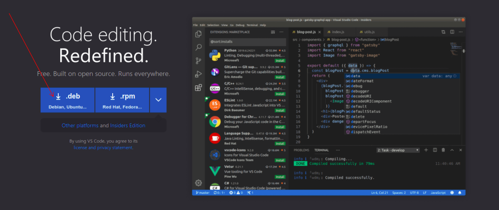

# Cài đặt môi trường cho Go

Nếu ai chưa biết về đặc điểm cũng như lích sử ra đời của Go thì có thể đọc bài tại đây: https://github.com/nartvt/go-learn/tree/master/go-history

# Cài đặt Golang trên Ubuntu 
Vì hiện tại chỉ có ubuntu nên trong bài này, sẽ hướng dẫn cài đặt trên ubuntu

chúng ta sẽ tải file cài đặt Go trên trang chủ tại: https://golang.org/


<br>

nó sẽ dẫn đến trang dowload để có thể chọn bản cài đặt tương ứng với hệ điều hành mà anh em đang sử dụng như windows, Linux, MacOS.

Ở đây mình sử dụng Ubuntu nên chọn phiên bản của linux 


<br>

Mở terminal và chuyển đến thư mục chưa file <strong style="color:white;">go1.16.7-linux-amd64.tar.gz</strong>


<br>

tiến hành kiểm tra thư mục đinh giải nén file go vừa tải về 
ở đây mình chọn giải nén vào thư mục : <strong  style="color:white;"> /usr/local</strong>


<br>

Tiến hành giải nén file <strong style="color:white;">go1.16.7-linux-amd64.tar.gz</strong> vào thư mục <strong  style="color:white;"> /usr/local</strong>
với lệnh:

    sudo tar -C /usr/local -xzf go1.16.7.linux-amd64.tar.gz


<br>
một thư mục tên go đã xuất hiện sau khi giải nén 

## Cài đặt GOROOT và GOPATH
Việc cài đặt <i>GOROOT</i> trong go tương tự như cài đặt JAVA_HOME trong java
vậy, để ta có thể sử dụng lệnh go khi tiến hành biên dịch và chạy dự án

Tại terminal, gõ cd để trở về  thư mục gốc của người dùng hiện tại


<br>

    .bashrc là 1 file viết bằng ngôn ngữ shell, khi máy tính khởi động, 
    hoặc khi bạn mở 1 terminal nó sẽ kiểm tra các cài đặt trong file này
    và tiến hành load lên những cài đặt ở trong file, vì vậy đặt ở đây, bạn sẽ có tất cả environment được load sẵn mỗi khi mở máy,thay vì phải làm đi làm lại nếu export ở màn hình terminal

mở file .bashrc bằng lệnh 
    
    vi .bashrc

Lưu ý: nếu bạn không quen sửa file bằng lệnh vi , b có thể làm theo cách sau
- Tại thư mục user , bấm Ctrl + H để hiện các tập tin ẩn
mở file .bashrc bằng bất kì editor vào(vs code, gedit ... )


<br>

thêm vào cuối file 3 dòng như sau

    export GOROOT=/usr/local/go
    export GOPATH=$HOME/go
    export PATH=$GOPATH/bin:$PATH:$GOROOT/bin

lưu lại file và thoát ra,  kiểm tra version go đã cài đặt trên máy với lệnh 

    go version

và ta nhận được 1 thông báo rằng 

    Command 'go' not found, but can be installed with


<br>

Vì sao cài đặt Go đã hoàn thành, nhưng kiểm tra lại không thấy, đó là vì bạn chưa thông báo với hệ điều hành những về những gì vừa thay đổi 
Tại thư mục chưa file, để lưu lại những thay đổi ở bên trên cho hệ điều hành, mở màn hình terminal gõ lệnh sau 
    source .bashrc

Kiếm tra lại phiên bản Go đã cài đặt trên máy bằng lệnh

    go version

Máy tính đã xác nhận phiên bản vừa cài đặt trên máy 

<br>

# Cài đặt IDE để bắt đầu chinh chiến với Go

## Visual studio Code - IDE đa năng cho mọi ngôn ngữ từ Microsoft và miễn phí
Giá: miễn phí

Tải file cài đặt tại: https://code.visualstudio.com/

Vì Ubuntu sử dụng package deb nên ở đây mình sẽ tải bản cài đặt .deb

 
<br>

File <strong style="color:white;">code_1.59.0-1628120042_amd64.deb</strong>
đã tải xong


<br>
    Tiến hành cài đặt bằng lệnh
        
        sudo dpkg -i <file name>

ở đây <file name> là <strong style="color:white;">code_1.59.0-1628120042_amd64.deb</strong>
nên ta có:
        
    sudo dpkg -i code_1.59.0-1628120042_amd64.deb

<br>
    Xong !

    Mở Visual từ terminal 


<br>
    
    Chọn extendsion của menu bên trái VS Code, nơi sẽ tiến hành cài đặt các plugin từ marketplace
    , gõ từ khóa Go vào ô tìm kiếm và cài đặt Go plugin - bản chính thức từ Go Team 

<br>

    Tiến hành test và chạy thử chương trình Go đầu tiên

    Plugin đã có tác dụng và phát hiện và đề xuất được những từ khóa trong Go khi gõ

<br>

    Chạy thử 


<br>

## Goland - sản phẩm xịn sò của team Intelliji 
Giá: 199$
Tuy nhiên có thể dùng thử 30 ngày trước khi quyết định xuống tay mua 

Tải file cài đặt tại: https://www.jetbrains.com/go/

giải nén Goland file vừa tải bằng lệnh: 

    sudo tar -xvf goland-2021.2.tar.gz

    

<br>

<br>

Tạo desktop file cho Goland

Trên terminal Di chuyển đến thư mục tạo desktop file 

    cd  ~/.local/share/applications/

Tạo 1 file desktop và mở nó lên với lệnh 

    nano goland.desktop

Add đoạn text dưới đây vào file vừa tạo ra

``` bash
[Desktop Entry]
Version=1.0
Type=Application
Name=Goland
Exec="/home/nartvt/Download/GoLand-2021.2/bin/goland.sh" %f
Icon=/home/nartvt/Download/GoLand-2021.2/bin/goland.svg
Categories=Development;IDE;
Terminal=false
StartupNotify=false
Name[en_GB]=Goland
```

Đường dẫn đến thu mục chưa goland và shell script thực thi- thay đổi cho phù hợp với nơi bạn đặt folder Goland vừa giải nén

    Exec="/home/nartvt/Download/GoLand-2021.2/bin/goland.sh" %f

Đường dẫn đến thư mục chứa icon file cho goland

    Icon=/home/nartvt/Download/GoLand-2021.2/bin/goland.svg


sau khi save lại , tại cửa sổ terminal gõ lệnh 

    source goland.desktop 

để cập nhật thay đổi

Tại Applications center của Ubuntu, chúng ta đã có Goland , kéo thả nó vào thanh bar để tiện truy cập khi cần dùng đến


<br>

Chọn Evaluate for free, để kích hoạt dùng thử 30 ngày


<br>


<br>
<br>

Mở Goland -> File -> New -> Project
Location: nơi sẽ lưu project sau khi được tạo<br>
GOROOT: folder root cài đặt Go, mặc định sẽ tự phát hiện nếu trước đó trong hệ thông đã cài sẵn Go


<br>

Sau khi bấm create, project đã được tạo với go module (go.mod) đã được tạo sẵn (kể từ phiên bản 1.16 - https://github.com/nartvt/go-learn/tree/master/go-history)


<br>

Chuột phải vào project chọn New -> go file , đặt tên, ở đây là main.go
Thêm 1 đoạn code đơn giản là in ra 1 dòng "Hello World" quen thuộc của mọi lập trình viên như sau 


<br>

để chạy được chương trình, ta cần chỉ cho go compiler biết đâu là nơi nó cần lấy file để chạy như sau:
Trên góc phải của Goland, click vào <strong>Add Configuration</strong>
> chọn dấu + ở bên góc trên trái của màn hình hiện ra, chọn Go build trong danh sách -> apl 

Chọn Apply -> OK <br>

<br>

 <br>

Click vào nút Run <br>
 <br>

Và cái kết<br>

<br>

Nguồn: 
1. https://golang.org/doc/install#tarball_non_standard